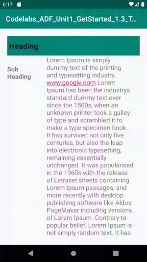

# Homework - Android fundamentals 01.3: Text and scrolling views

## Homework

## Change an app :

Open the ScrollingText2 app that you created in the Working with TextView Elements lesson.

1. - [x] Change the subheading so that it wraps within a column on the left that is 100 dp wide, as shown below. 
2. - [x] Place the text of the article to the right of the subheading as shown below.

## Answer these questions

### Question 1

How many views can you use within a ScrollView? Choose one:

* One view only
* - [x] One view or one view group
* As many as you need

### Question 2

Which XML attribute do you use in a LinearLayout to show views side by side? Choose one:

* - [x] android:orientation="horizontal"
* android:orientation="vertical"
* android:layout_width="wrap_content"

### Question 3 

Which XML attribute do you use to define the width of the LinearLayout inside the scrolling view? Choose one:

* - [x] android:layout_width="wrap_content"
* android:layout_width="match_parent"
* android:layout_width="200dp"

# Follow on [Twitter](https://twitter.com/amansharma_dev) :bird:

## Thank You.
